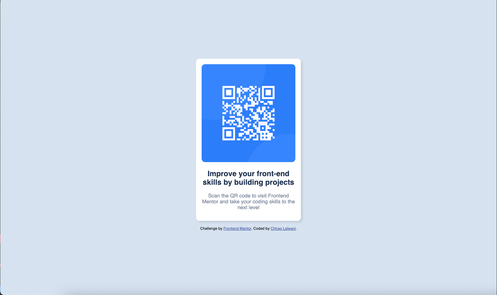

# Frontend Mentor - QR code component solution

This is a solution to the [QR code component challenge on Frontend Mentor](https://www.frontendmentor.io/challenges/qr-code-component-iux_sIO_H). Frontend Mentor challenges help you improve your coding skills by building realistic projects. 

## Table of contents

- [Overview](#overview)
  - [Screenshot](#screenshot)
  - [Links](#links)
- [My process](#my-process)
  - [Built with](#built-with)
  - [What I learned](#what-i-learned)
  - [Continued development](#continued-development)
  - [Useful resources](#useful-resources)
- [Author](#author)
- [Acknowledgments](#acknowledgments)

## Overview

### Screenshot




### Links

- Solution URL: [Add solution URL here](https://github.com/lalwanichiragsocial3/frontendMentor-QRCode)
- Live Site URL: [Add live site URL here](https://lalwanichiragsocial3.github.io/frontendMentor-QRCode/)

## My process

### Built with

- Semantic HTML5 markup
- CSS custom properties
- Flexbox

### What I learned

At some point, I was confused with the font-size mention in style guide which was set to 15px, but I saw different font-size inside the card, therefore, I setup that as base size for body element.

```css
body{
    width: 100%;
    height: 100vh;
    display: flex;
    flex-direction: column;
    justify-content: center;
    align-items: center;
    font-size: 15px;
	font-family: 'Outfit', sans-serif;
}
```


If you want more help with writing markdown, we'd recommend checking out [The Markdown Guide](https://www.markdownguide.org/) to learn more.


## Author

- Website - [Chirag Lalwani](https://www.chiraglalwani.com)
- Frontend Mentor - [@yourusername](https://www.frontendmentor.io/profile/lalwanichirag3)

## Acknowledgments

At some point, I was confused with the card width and height, so for reference, I had looked into this github profile: (https://github.com/Arekkusu17/QR-code-component-challenge)

